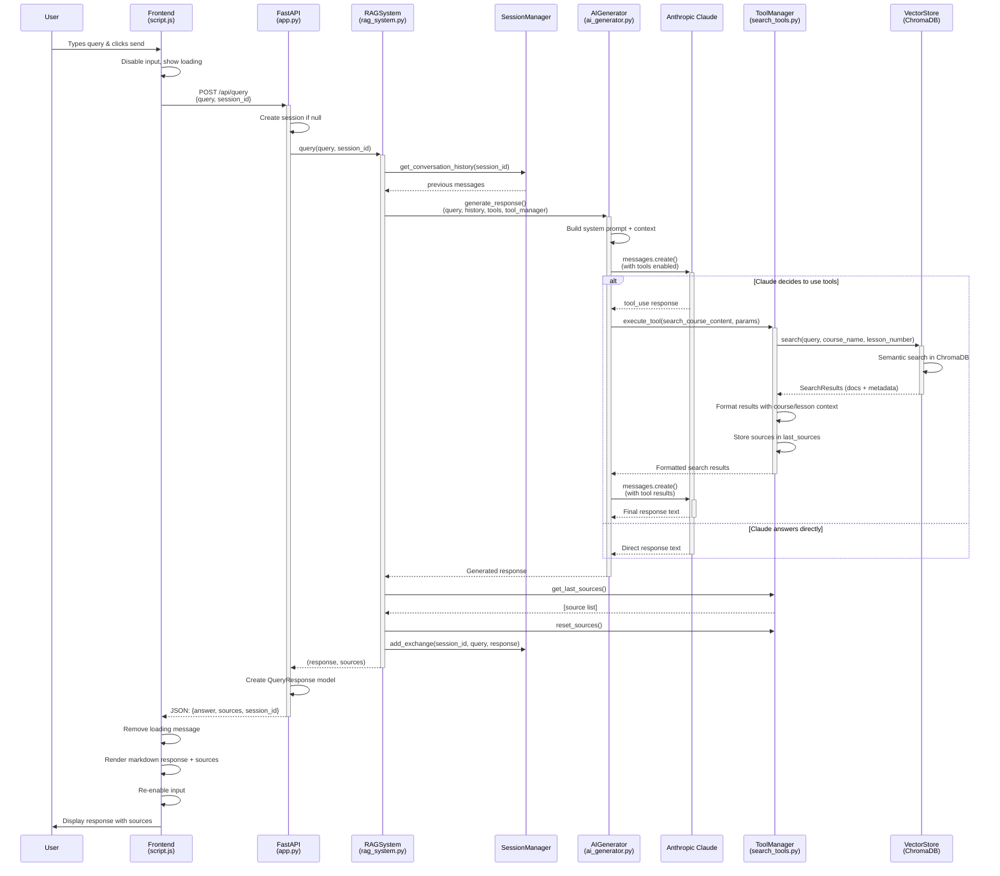
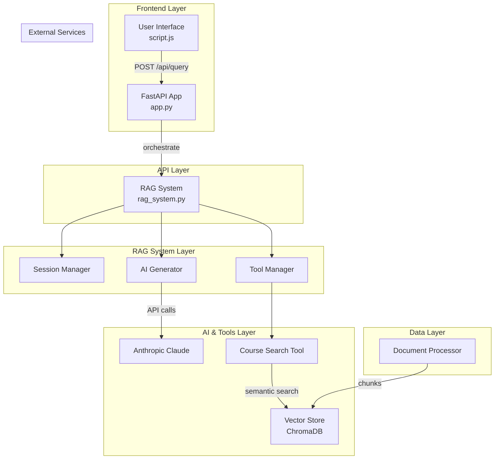
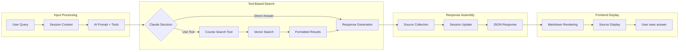

# RAG Chatbot Query Flow Diagram

## Component Responsibilities

## Data Flow Architecture

## Key Design Patterns

1. **Tool-Based RAG**: AI decides when to search rather than always searching
2. **Session Persistence**: Conversation context maintained across queries
3. **Modular Architecture**: Clear separation of concerns
4. **Error Handling**: Comprehensive error handling at each layer
5. **Source Tracking**: UI transparency about information sources
6. **Async Processing**: Non-blocking API calls and database operations